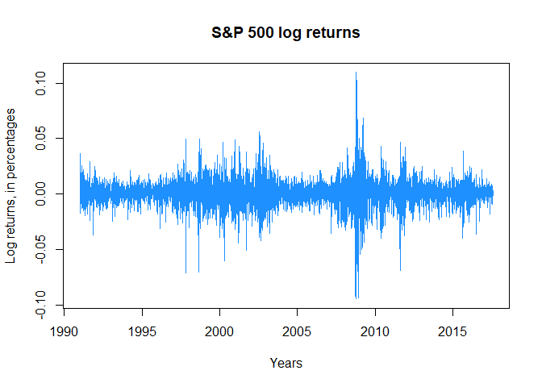
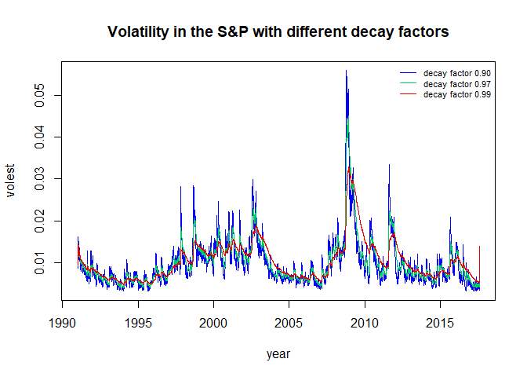

MSDS 6306: Unit 11 Assignment
================
Chris Havenstein
July 30, 2017

Analysis
========

#### This analysis of the S&P 500 data uses data from Yahoo finance. The analysis runs from 1991-01-02 to the the most recent closing price for the S&P 500.

First, we will set our working directory. For this project, my working directory looks like the following. However, you would set your own if you were recreating this code.

-   ./MSDS 6306 Assignment 11/Analysis

``` r
setwd("C:/Users/Chris/Desktop/GIT home/MSDS 6306 Assignment 11/Analysis")
```

At this point, I will source the final chart, using the provided R code file. Then, we will walk through the steps to create it. An output of the most recent closing price is provided.

    ## time series ends   2017-07-28


Now that you see where we are trying to get to, let's start at the beginning.

#### Downloading the data.

The next step is to download the data. To do this we will use the "tseries" package. Later we will also use the "zoo" package, too. I have already installed these packages locally but you may need to install them by using the following code.

-   install.packages("tseries")
-   install.packages("zoo")

I also want to make a special mention that you should have the latest version of R to ensure the tseries package works.

``` r
#load the packages
library(tseries)
library(zoo)

#Download the S&P data
SNPdata <- get.hist.quote('^gspc',quote="Close")
```

    ## time series ends   2017-07-28

``` r
#Show what the data looks like
head(SNPdata)
```

    ##             Close
    ## 1991-01-02 326.45
    ## 1991-01-03 321.91
    ## 1991-01-04 321.00
    ## 1991-01-07 315.44
    ## 1991-01-08 314.90
    ## 1991-01-09 311.49

``` r
#How many records are there?
nrow(SNPdata)
```

    ## [1] 6696

#### Calculating the log returns

The next step is calculating the log returns for the S&P 500. We are using log returns to reduce the impact of outliers. These returns are measured in percentage returns.

``` r
#calculate the log returns
SNPret <- log(lag(SNPdata)) - log(SNPdata)

#What do the log returns look like?
plot(SNPret, col="dodgerblue",main="S&P 500 log returns", xlab="Years", ylab="Log returns, in percentages")
```



Whoa, there is a huge spike around 2008 when the financial crisis occurred. We want to do something to try and normalize this and account for the volatility.

#### Calculating the volatility measure.

We need an estimate of the volatility, then we will use this calculate the volatility over the length of the S&P 500 returns data. This Volatility measure acts as standard deviation for the sample of S&P 500 returns data.

``` r
#calculate the volitily measure
SNPvol <- sd(SNPret) * sqrt(250) * 100


#What is the volatility estimate?
SNPvol
```

    ## [1] 17.70868

#### Calculating volatility over the range of the data for different decay factors

We will calculate the decay factor using a volatility function. The decay function is provided below.

Then, we will calculate three decay factors using this volatility function. As the decay function increases, we have a smaller look back towards previous volatility, creating a smoother curve. In the case of the S&P 500 volatility, that will make the the S&P returns look less volatile than they actually are.

``` r
## volatility
getVol <- function(d, logrets)
{

    var = 0

    lam = 0

    varlist <- c()

    for (r in logrets) {

        lam = lam*(1 - 1/d) + 1
    
    var = (1 - 1/lam)*var + (1/lam)*r^2

        varlist <- c(varlist, var)

    }

    sqrt(varlist)
}


# Recreate Figure 6.12 in the text on page 155

#calculate the volatility estimate with a decay factor of 0.90
volest <- getVol(10,SNPret)
#fix the index to be a date
volest <- zoo(volest, order.by = index(SNPdata))

#calculate the volatility estimate with a decay factor of ~0.97
volest2 <- getVol(30,SNPret)
#fix the index to be a date
volest2 <- zoo(volest2, order.by = index(SNPdata))

#calculate the volatility estimate with a decay factor of 0.99
volest3 <- getVol(100,SNPret)
#fix the index to be a date
volest3 <- zoo(volest3, order.by = index(SNPdata))
```

#### Plot the the results for the volatility curves

Last but not least, we will plot the volativity curves using these different decay factors.

``` r
#Plot the volativity data
#First, plot the decay factor of 0.9
plot(volest,type="l", col="blue", main="Volatility in the S&P with different decay factors", xlab="year")

#Second, plot the decay factor of ~0.97
lines(volest2,type="l",col="springgreen3")

#Last, plot the decay factor of 0.99
lines(volest3, type = "l", col="red2")

#Plot a legend
legend("topright",c("decay factor 0.90","decay factor 0.97","decay factor 0.99"), lty=1, col = c("blue","springgreen3","red2"),bty='n', cex=.70)
```



Notice how much of a difference the volatility estimates change when the decay factor increases! This makes the red line, a decay factor of 0.99 looks less risky, than it actually was. Therefore, when estimating the volatility, we should choose a realistic value.

Hopefully this short example showed the importance of choosing a correct decay factor (also known as an exponential downweighting factor) when working with time series data! I hope that you had as much fun as I did!
